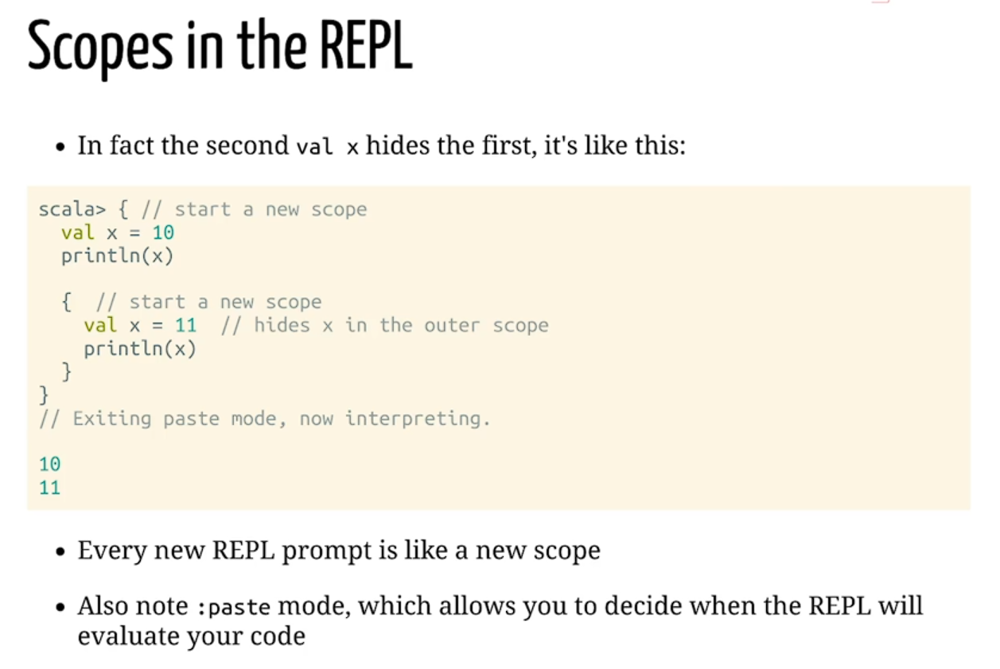
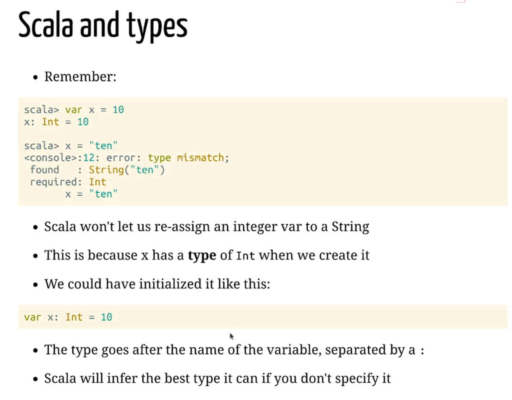
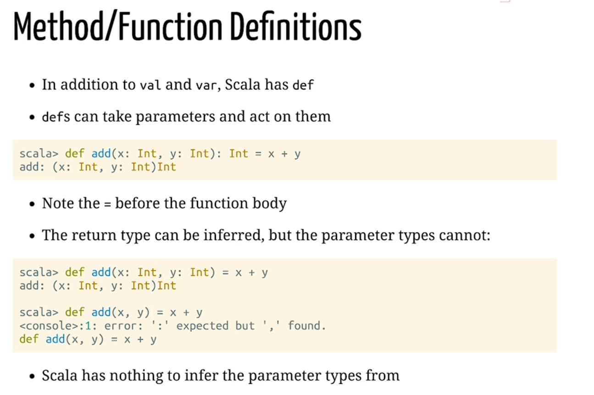
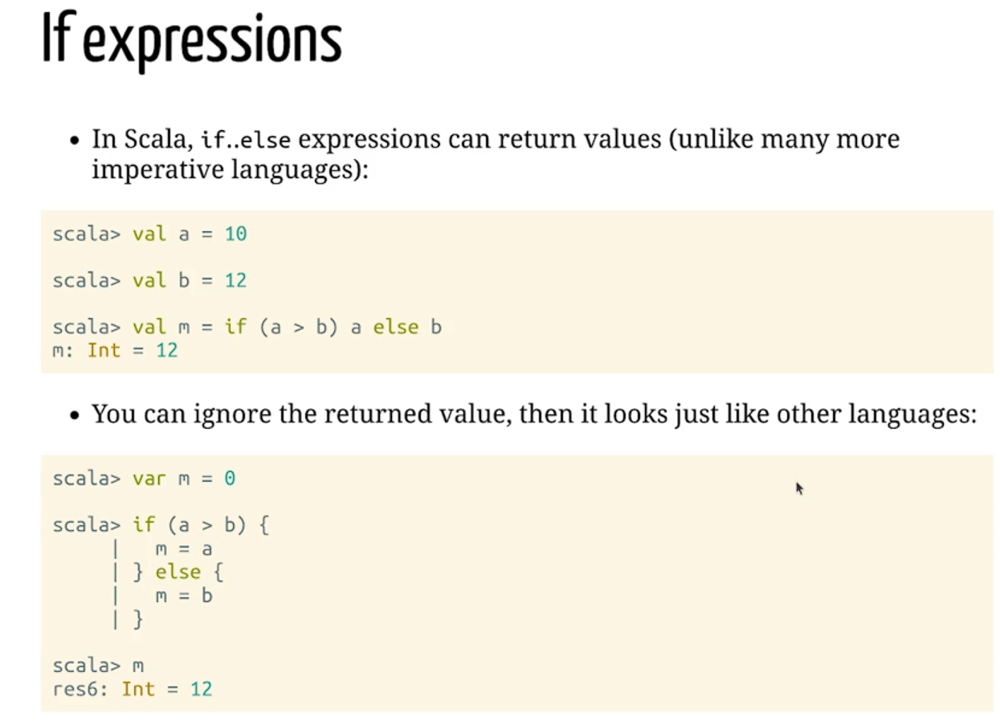

# Lecture 1. Introduction to Sacla 3

- SBT - build tool for Scala 
-  REPL - Read, Evaluate, Print, Loop
- `val` -is final variable definition, it can't be re-assigned with a different value
- `var` - is mutable variable definition, it can't be reassigned with another value of the **same type**
- 
-  
- 
- 